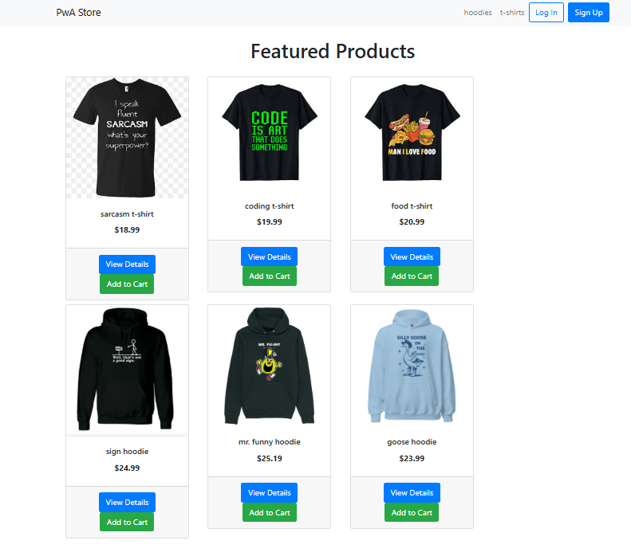

# 🛍️ PWA-L3 Shop Demo

This is a study/demo e-commerce site built with **Django**.  
The project showcases a simple product catalog, cart system, and static media integration.

---

## 🌐 Live Demo
👉 **[Visit the live shop here](https://pwa-l3.onrender.com/)**  
_(Hosted on Render)_

---

## 🖼️ Screenshot

> The screenshot shows the homepage of the live demo, with product cards and working images.

---

## 🧩 Features
- Product list and category pages  
- Cart system  
- Static image display (no database uploads needed)  
- Simple and clean UI  
- Deploy-ready on Render  

---

## 🛠️ Tech Stack
- Python 3.12  
- Django 5.x  
- HTML, Bootstrap, CSS  
- Render (for hosting)

---

